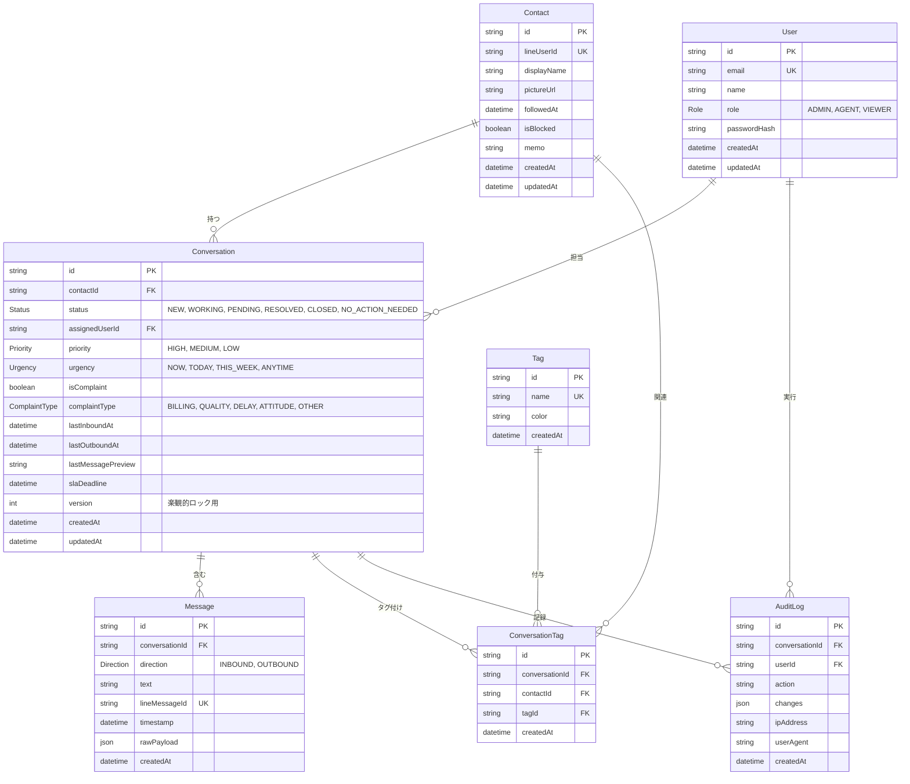

# データベース設計ドキュメント

## 概要
LINE対応ダッシュボードのデータベーススキーマ設計書

**作成日**: 2026-01-06
**バージョン**: 1.0.0
**DBMS**: PostgreSQL 15
**ORM**: Prisma 5.x

## ER図

## テーブル詳細

### User（社内ユーザー）
管理者・担当者の情報を管理

| カラム | 型 | 制約 | 説明 |
|--------|-----|------|------|
| id | TEXT | PK | CUID |
| email | TEXT | UNIQUE, NOT NULL | メールアドレス |
| name | TEXT | NOT NULL | ユーザー名 |
| role | Role | NOT NULL, DEFAULT 'AGENT' | 権限（ADMIN/AGENT/VIEWER） |
| passwordHash | TEXT | NULL | パスワードハッシュ（bcrypt） |
| createdAt | TIMESTAMP | NOT NULL | 作成日時 |
| updatedAt | TIMESTAMP | NOT NULL | 更新日時 |

**インデックス**:
- `email` (unique + index)
- `role` (index)

---

### Contact（LINEユーザー）
LINE公式アカウントの友だち情報

| カラム | 型 | 制約 | 説明 |
|--------|-----|------|------|
| id | TEXT | PK | CUID |
| lineUserId | TEXT | UNIQUE, NOT NULL | LINE User ID |
| displayName | TEXT | NOT NULL | 表示名 |
| pictureUrl | TEXT | NULL | プロフィール画像URL |
| followedAt | TIMESTAMP | NOT NULL | フォロー日時 |
| isBlocked | BOOLEAN | NOT NULL, DEFAULT false | ブロック状態 |
| memo | TEXT | NULL | 内部メモ |
| createdAt | TIMESTAMP | NOT NULL | 作成日時 |
| updatedAt | TIMESTAMP | NOT NULL | 更新日時 |

**インデックス**:
- `lineUserId` (unique + index)
- `displayName` (index)

---

### Conversation（会話スレッド）
Contact単位の会話管理

| カラム | 型 | 制約 | 説明 |
|--------|-----|------|------|
| id | TEXT | PK | CUID |
| contactId | TEXT | FK, NOT NULL | Contactへの外部キー |
| status | Status | NOT NULL, DEFAULT 'NEW' | ステータス |
| assignedUserId | TEXT | FK, NULL | 担当ユーザーID |
| priority | Priority | NOT NULL, DEFAULT 'MEDIUM' | 重要度 |
| urgency | Urgency | NOT NULL, DEFAULT 'ANYTIME' | 緊急度 |
| isComplaint | BOOLEAN | NOT NULL, DEFAULT false | クレームフラグ |
| complaintType | ComplaintType | NULL | クレーム種別 |
| lastInboundAt | TIMESTAMP | NULL | 最終受信日時 |
| lastOutboundAt | TIMESTAMP | NULL | 最終送信日時 |
| lastMessagePreview | TEXT | NULL | 最終メッセージプレビュー |
| slaDeadline | TIMESTAMP | NULL | SLA期限 |
| version | INTEGER | NOT NULL, DEFAULT 0 | 楽観的ロックバージョン |
| createdAt | TIMESTAMP | NOT NULL | 作成日時 |
| updatedAt | TIMESTAMP | NOT NULL | 更新日時 |

**インデックス**:
- `contactId` (index)
- `status` (index)
- `assignedUserId` (index)
- `lastInboundAt` (index)
- `(priority, urgency)` (複合index)

---

### Message（メッセージ）
LINEメッセージの送受信履歴

| カラム | 型 | 制約 | 説明 |
|--------|-----|------|------|
| id | TEXT | PK | CUID |
| conversationId | TEXT | FK, NOT NULL | 会話スレッドID |
| direction | Direction | NOT NULL | 方向（INBOUND/OUTBOUND） |
| text | TEXT | NULL | テキスト内容 |
| lineMessageId | TEXT | UNIQUE, NULL | LINE Message ID |
| timestamp | TIMESTAMP | NOT NULL | メッセージ日時 |
| rawPayload | JSONB | NULL | LINEからの生JSON |
| createdAt | TIMESTAMP | NOT NULL | 作成日時 |

**インデックス**:
- `lineMessageId` (unique)
- `conversationId` (index)
- `timestamp` (index)
- `direction` (index)

---

### Tag（タグマスタ）
会話を分類するためのタグ

| カラム | 型 | 制約 | 説明 |
|--------|-----|------|------|
| id | TEXT | PK | CUID |
| name | TEXT | UNIQUE, NOT NULL | タグ名 |
| color | TEXT | NULL | 表示色（HEX） |
| createdAt | TIMESTAMP | NOT NULL | 作成日時 |

**インデックス**:
- `name` (unique)

---

### ConversationTag（会話×タグ中間テーブル）
会話とタグの多対多リレーション

| カラム | 型 | 制約 | 説明 |
|--------|-----|------|------|
| id | TEXT | PK | CUID |
| conversationId | TEXT | FK, NOT NULL | 会話ID |
| contactId | TEXT | FK, NOT NULL | コンタクトID |
| tagId | TEXT | FK, NOT NULL | タグID |
| createdAt | TIMESTAMP | NOT NULL | 作成日時 |

**インデックス**:
- `conversationId` (index)
- `tagId` (index)
- `(conversationId, tagId)` (複合unique)

---

### AuditLog（監査ログ）
システム操作の監査記録

| カラム | 型 | 制約 | 説明 |
|--------|-----|------|------|
| id | TEXT | PK | CUID |
| conversationId | TEXT | FK, NULL | 対象会話ID |
| userId | TEXT | FK, NOT NULL | 実行ユーザーID |
| action | TEXT | NOT NULL | アクション名 |
| changes | JSONB | NULL | 変更内容 |
| ipAddress | TEXT | NULL | IPアドレス |
| userAgent | TEXT | NULL | User Agent |
| createdAt | TIMESTAMP | NOT NULL | 作成日時 |

**インデックス**:
- `conversationId` (index)
- `userId` (index)
- `createdAt` (index)

---

## Enum型定義

### Role（ユーザー権限）
- `ADMIN`: 管理者（全権限）
- `AGENT`: 担当者（対応・返信）
- `VIEWER`: 閲覧者（参照のみ）

### Status（会話ステータス）
- `NEW`: 新規
- `WORKING`: 対応中
- `PENDING`: 保留
- `RESOLVED`: 解決済み
- `CLOSED`: クローズ
- `NO_ACTION_NEEDED`: 対応不要

### Priority（重要度）
- `HIGH`: 高
- `MEDIUM`: 中
- `LOW`: 低

### Urgency（緊急度）
- `NOW`: 即対応
- `TODAY`: 当日中
- `THIS_WEEK`: 今週中
- `ANYTIME`: いつでも

### ComplaintType（クレーム種別）
- `BILLING`: 請求
- `QUALITY`: 品質
- `DELAY`: 遅延
- `ATTITUDE`: 態度
- `OTHER`: その他

### Direction（メッセージ方向）
- `INBOUND`: 受信（LINEユーザー → システム）
- `OUTBOUND`: 送信（システム → LINEユーザー）

---

## パフォーマンス考慮事項

### インデックス戦略
1. **高頻度クエリ**:
   - Conversation一覧取得: `status`, `assignedUserId`, `lastInboundAt`
   - メッセージ検索: `conversationId`, `timestamp`

2. **複合インデックス**:
   - `(priority, urgency)`: ソート・フィルタリング最適化

3. **Unique制約**:
   - `lineUserId`, `lineMessageId`: 重複防止

### 楽観的ロック
- `Conversation.version`: 競合検知
- 更新時に `WHERE version = :currentVersion` で検証

---

## シードデータ

### ユーザー
| Email | Role | Password |
|-------|------|----------|
| admin@example.com | ADMIN | admin123 |
| agent@example.com | AGENT | agent123 |
| viewer@example.com | VIEWER | viewer123 |

### タグ
| Name | Color |
|------|-------|
| VIP | #FFD700 |
| 要注意 | #FF0000 |
| 継続中 | #00FF00 |
| 解約候補 | #FFA500 |

---

## マイグレーション履歴

### 20260106211057_init
初期スキーマ作成
- 全テーブル作成
- Enum型定義
- インデックス設定
- 外部キー制約

---

## 今後の拡張予定（Phase 2）

1. **templates テーブル**: 返信テンプレート管理
2. **sla_rules テーブル**: SLAルール定義
3. **attachments テーブル**: 添付ファイル管理
4. **canned_responses テーブル**: 定型文管理

---

## 備考

- CUID: Collision-resistant Unique Identifier（分散環境に適した一意ID）
- JSONB: PostgreSQLのバイナリJSON型（高速検索・インデックス可能）
- 楽観的ロック: 同時更新競合を検知・防止
